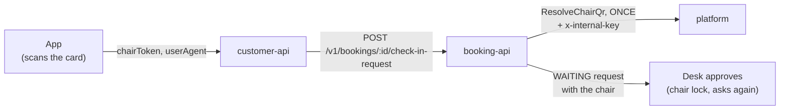

# Chair check-in: booking-api's side

A customer sits down, scans the QR card on the chair, and the app says "I am
here" for their booking **with that chair**. booking-api asks platform which
chair the card is, decides whether this booking may have it, and raises the
ordinary self check-in request carrying the chair. The desk approves it as
before.

**Platform owns the contract, so platform's note is the source of truth:**
`gostyle-platform/docs/chair-directory-team.md`. It has the call, every field,
every error, the key and its three log lines, and the rules booking-api
follows. This page does not repeat them. It covers only what booking-api adds
on top, and how to run and check it.



---

## 1. The route

`POST /v1/bookings/:id/check-in-request`, the customer's existing raise, behind
`SELF_CHECK_IN_V1` as before. The body is new, and every field is optional:

| Field        | Meaning                                                                                                              |
| ------------ | -------------------------------------------------------------------------------------------------------------------- |
| `chairToken` | The raw token off the chair's card, exactly as scanned. Absent: a request with no chair (Wait for Staff, section 2). |
| `userAgent`  | The app's user agent, recorded on the salon's scan of the card. customer-api forwards the app's own.                 |

No body behaves exactly as before. With `chairToken`, the answers are:

| Status | Code                     | `details`                                                     | What the customer reads                                                        |
| ------ | ------------------------ | ------------------------------------------------------------- | ------------------------------------------------------------------------------ |
| 201    |                          | `request.chair` = `{ number, zoneName }`                      | The request waits for the desk, with the chair on it.                          |
| 409    | `BOOKING_CHAIR_REFUSED`  | `reason: CARD_OUT_OF_DATE`                                    | "This card is out of date. Please see the desk."                               |
| 409    | `BOOKING_CHAIR_REFUSED`  | `reason: OTHER_SALON`                                         | "This chair is not at the salon of your booking. Please see the desk."         |
| 409    | `BOOKING_CHAIR_REFUSED`  | `reason: CHAIR_NOT_AVAILABLE`                                 | "That chair is not available. Please take another or see the desk."            |
| 409    | `BOOKING_CHAIR_REFUSED`  | `reason: UNKNOWN_CARD`                                        | "This is not a chair card we know. Please scan the card on your chair, or see the desk." |
| 503    | `DEPENDENCY_UNAVAILABLE` | `reason: CHAIR_CHECK_UNAVAILABLE`, `fallback: WAIT_FOR_STAFF` | "We could not check this chair just now. Please use Wait for Staff and the desk will check you in." |

The booking's own refusals (`BOOKING_STATE_INVALID`, `BOOKING_CHECKIN_WINDOW`,
`BOOKING_CHECKIN_REJECTED`) come first and are unchanged: a booking that may not
raise at all is told so, whatever chair it scanned.

**The app shows `message` and may switch on `details.reason`. Nothing else.**
`CHAIR_NOT_AVAILABLE` covers both "the chair may not take a booking" and
"somebody is in it": to the customer both mean "not this chair", with the same
way out. Platform's words for the chair (`FROZEN`, `MAINTENANCE`, ...) and
another customer's booking code never reach the app. They go to booking-api's
log and to the desk. If the app learned platform's state names, it would show a
blank or a raw word the day platform added one.

The desk's approve (`POST /v1/bookings/:id/check-in-request/approve`) can now also answer
409 `BOOKING_CHAIR_REFUSED` with `reason: CHAIR_OCCUPIED`, `chairNumber` and
`occupant` (the booking code in the chair): "Chair 7 is taken: GS-1402 is
checked in there. If that visit is over, finish it and approve again;
otherwise the customer needs another chair." Nothing was checked in, and the
request still waits.

## 2. When platform does not answer: Wait for Staff

The 503 is **not** "check-in is broken". It means booking-api could not check
the chair: platform is down or slow (2s), or the two services disagree about
the key.

**The app falls back to Wait for Staff:** the same POST with **no**
`chairToken`. That path never calls platform. It raises a request with no
chair, the desk approves it, and the customer is checked in as they were before
chairs existed. The 503's message says so, so the customer is not left reading
"try again".

booking-api never does that fallback by itself. A request raised without the
chair after platform failed would look exactly like a Wait for Staff request,
so nobody would ever learn the chair went unchecked. A visible failure is
better than a silent downgrade.

## 3. What booking-api decides

Platform answers what the card and the chair are. booking-api decides, in this
order (`src/domain/booking/chair-check-in.ts`):

1. **The card is `LIVE`.** Anything else is out of date (v1).
2. **The chair is in the booking's own tenant and branch.** A booking with no
   tenant never matches: the customer is sent to the desk, and the log names it
   `untenanted_booking`, a data fault.
3. **Platform's `chair_bookable` is true.** Decided on that alone, never on
   `chair_state`: which states may take a booking is platform's rule.
4. **Nobody else is in the chair.** A booking is in the chair when it is
   `checked_in` or `in_service`, on the same branch and trading day, and its
   latest request names this chair and was **not rejected**. Not only an
   approved one: a customer who scanned chair 7 and was then checked in with
   the desk's own button (their request closes) is sitting in chair 7. The
   trading day keeps a visit nobody closed yesterday from holding the chair
   forever.

**A waiting request does not block the chair.** A claim can be stale, and
blocking would hold a free chair until the desk answered. Approving is the
moment that matters, so **approve asks again** under the chair's lock: two desks
approving two customers for one chair take turns, and the second is told who is
in it.

### Where it lives

| What                                           | File                                                                                    |
| ---------------------------------------------- | --------------------------------------------------------------------------------------- |
| The rule, and what the customer is told        | `src/domain/booking/chair-check-in.ts`                                                  |
| "Who is in this chair" as SQL, and the chair lock | `src/infrastructure/persistence/check-in-request.repository.ts` (`occupantOf`, `CHAIR_LOCK_CLASS`) |
| Asking platform: once, 2s, no retry            | `src/infrastructure/grpc/grpc-chair-directory.ts` (`callOnce`)                          |
| The port                                       | `src/application/ports/chair-directory.port.ts`                                         |
| The route and its answers                      | `src/interface/http/check-in-request.controller.ts`, `src/application/commands/check-in-request.handler.ts` |
| The columns and their CHECKs                   | `prisma/migrations/20261008175925_chair_check_in/migration.sql`                         |
| The contract, copied from platform             | `proto/floor.proto`                                                                     |

The chair lock is Postgres's two-int advisory lock, `(CHAIR_LOCK_CLASS,
hashtext(chair_id))`. The capacity locks use the one-bigint form, and Postgres
keeps the two forms in key spaces that do not overlap, so a hold and an
approval can never wait on each other. The comment above `CHAIR_LOCK_CLASS`
says why it is separate rather than reused.

## 4. The key: `PLATFORM_INTERNAL_KEY`

It must hold the **same value** on platform and on booking-api, and a
**different** one from `INTERNAL_GRPC_KEY` (booking-api to customer-api). Read
on every call: changing it needs a restart, not a rebuild.

- **Local, in Docker:** `docker-compose.yml` defaults it to
  `dev-platform-internal-key`, platform's own dev default.
- **Local, from source:** put `PLATFORM_INTERNAL_KEY=dev-platform-internal-key`
  in `.env`, or whatever the platform you point at holds.
- **Production:** booking's stack file lives on the server
  (`~/gostyle-booking-api/docker-compose.prod.yml` on srv1727706), not in this
  repo. Add `PLATFORM_INTERNAL_KEY: ${PLATFORM_INTERNAL_KEY}` to the api
  service's `environment`, read from `/opt/gostyle/.env.prod` exactly as
  `JWT_ACCESS_SECRET` already is. Platform reads the same file, so the two
  values cannot drift apart. A **bare** variable, not `:?`: empty fails closed
  and breaks chair scans only (503, Wait for Staff still works), where `:?`
  would abort the whole deploy over one feature's secret. Production's
  `PLATFORM_GRPC_ADDR` is `gostyle_api:50052`.

### What the log says

| booking-api line                                                                                    | Means                                                                                  |
| --------------------------------------------------------------------------------------------------- | -------------------------------------------------------------------------------------- |
| `GrpcChairDirectory` ERROR `PLATFORM_INTERNAL_KEY is not set on booking-api ...`                     | booking-api has no key. Every chair scan is refused before it reaches platform.        |
| `GrpcChairDirectory` ERROR `platform UNAUTHENTICATED ... platform refused our x-internal-key ...`   | The two values differ, or platform has none. Platform's warn line says which side.     |
| `GrpcChairDirectory` ERROR `platform UNIMPLEMENTED ... older than floor.proto (platform PR #178)`    | The platform answering is older than the contract. Deploy platform.                    |
| `GrpcChairDirectory` WARN `ResolveChairQr: platform UNAVAILABLE ... sent to the desk`               | Platform down or slow, one line per scan: each is a customer sent to Wait for Staff.   |
| `CheckInRequestHandler` `Chair claim refused on booking ...: chair_not_bookable (chair state FROZEN)` | A refusal, with platform's words. For you and the desk, never for the app.            |

**The three ERROR lines are logged once per process,** and each says *"this will
not be logged again until the service restarts"*. A wrong key shows one ERROR
and then silence while every customer who sits down gets a 503. **Silence after
that line does not mean it was fixed.**

Platform's side of the same failure: its three `Refused
ChairDirectory.ResolveChairQr:` warn lines, in platform's note, section 3.

## 5. Keeping `floor.proto` in step

`proto/floor.proto` is platform's file, copied byte for byte from platform main
at `6a2ca47e` (PR #178). Never edit it here: change platform's, then copy it
again.

`src/infrastructure/grpc/floor-proto.spec.ts` pins its sha256. **It will fail
the day platform changes the file and somebody copies it again.** That is the
day to read what changed (a renamed or renumbered field reads as empty, with no
error), then update the hash. To compare, from the folder above both repos:

```bash
cmp gostyle-platform/apps/gostyle-api/proto/floor.proto gostyle-booking-api/proto/floor.proto
```

The client loads it with `keepCase: true` (`src/infrastructure/grpc/floor-grpc.constants.ts`).
Without it every field reads `undefined`, and an undefined `chair_bookable`
refuses every chair with no error anywhere.

## 6. Proving it locally

Throwaway databases only (the name must say checkin, test or proof). The status
history is append-only.

```bash
createdb gostyle_booking_chair_proof
DATABASE_URL=postgres://.../gostyle_booking_chair_proof pnpm exec prisma migrate deploy

# The CHECKs, each made to fail:
psql postgres://.../gostyle_booking_chair_proof -X -f prisma/proof-chair-check-in.sql

# A platform that serves ChairDirectory, beside the docker one (from the
# platform repo, built):
PORT=3100 GRPC_PORT=50152 PLATFORM_INTERNAL_KEY=dev-platform-internal-key \
  node apps/gostyle-api/dist/main.js

# The adapter against it, then the whole flow (the database, the lock, the
# handler through platform):
LIVE_PLATFORM_GRPC_ADDR=localhost:50152 \
  pnpm exec vitest run src/infrastructure/grpc/grpc-chair-directory.live.spec.ts
LIVE_DATABASE_URL=postgres://.../gostyle_booking_chair_proof \
LIVE_PLATFORM_GRPC_ADDR=localhost:50152 \
  pnpm exec vitest run src/infrastructure/scheduling/self-check-in.live.spec.ts
```

If the local `gostyle-platform-api-1` container predates PR #178, it answers
`UNIMPLEMENTED`, and booking-api logs the "older than floor.proto" line. That is
why the side instance above exists.

These use made-up tokens, which write no scan row. A real card does write one;
`LIVE_CHAIR_TOKEN=<token>` adds that test.

## 7. Known limits and known issues

1. **A desk check-in records no chair** (accepted for v1). A customer checked in
   with the desk's own button, without ever scanning, is not in any chair as
   far as booking-api knows, so their chair reads as free.

2. **The capacity lock key is assembled in five places.** Not part of chair
   check-in (its lock is separate, section 3), but found while building it, and
   it will bite somebody. Every capacity-moving path builds the same string by
   hand, `<branch>:<resource type>:<trading day>`, and locks
   `pg_advisory_xact_lock(hashtextextended(key, 0))`:

   | File                                                         | Line | Builds the key from                                            |
   | ------------------------------------------------------------ | ---- | -------------------------------------------------------------- |
   | `src/infrastructure/persistence/hold.repository.ts`          | 192  | `input.branchId`, every resource type, sorted                  |
   | `src/infrastructure/persistence/group-hold.repository.ts`    | 114  | `input.branchId`, every resource type, sorted                  |
   | `src/infrastructure/persistence/group-confirm.repository.ts` | 131  | `input.branchId`, every resource type, sorted                  |
   | `src/infrastructure/persistence/series.repository.ts`        | 498  | `input.branchId`, one resource type                            |
   | `src/infrastructure/persistence/reschedule.repository.ts`    | 188  | `booking.branch_id` (read back, folded), the FIRST item's type |

   **They already differ.** `hold.repository.ts` locks on the raw
   `input.branchId` but writes and reads `toUuid(input.branchId)` (lines 206,
   222). `reschedule.repository.ts` locks on `booking.branch_id`, which holds the
   folded uuid. For a real, lowercase uuid the two keys are equal. For a slug
   branch (`marina-walk`), or a uuid in capitals, they are not, and a hold and a
   reschedule on the same chair type and day do not take turns. That is the
   slug/uuid boundary again (CLAUDE.md 8). Reschedule also locks only the first
   item's type where the others lock all of them. **The fix** is one function
   that builds the key from a folded branch id, imported by all five. Not done
   here.

3. **One attempt, no retry.** A retry after a timeout platform did serve would
   be a false scan. The cost: a connection dropped while idle can answer the
   first scan after it `UNAVAILABLE`. Keepalive (`channel-options.ts`) makes that
   rare, and the customer gets the 503 and Wait for Staff, or scans again, which
   is a real second scan.

4. **The real-card path has not been run against a real platform.** The local
   platform data has no chairs or cards. The decoding is covered by
   `floor-proto.spec.ts` (a round trip through the copied proto, with the
   client's own options) and the adapter's spec; the rest of the flow ran live
   with a scanned chair handed straight to the repository. Run it with
   `LIVE_CHAIR_TOKEN` once a local chair has a card, or watch the first real
   scans after rollout.

5. **Not built yet, in other repos:** customer-api forwarding `chairToken` and
   `userAgent` to this route, and the app's scan screen and its Wait for Staff
   fallback on 503.

6. **`staff.proto` has drifted from platform's** (additions booking-api does not
   use yet). See platform's note, section 2.

## 8. Rolling it out

1. **Platform** is deployed with PR #178, and `PLATFORM_INTERNAL_KEY` is set in
   `/opt/gostyle/.env.prod`.
2. **booking-api** is deployed by its sha with the migration (three nullable
   columns, additive) and the key line in its stack file (section 4). No new
   flag: the route is behind `SELF_CHECK_IN_V1` as before, and a raise without
   `chairToken` is unchanged.
3. **Watch the boot log** and the first scans for the lines in section 4.
4. **customer-api, then the app**, start sending `chairToken`.

**Turning it off:** the app stops sending `chairToken` (Wait for Staff only), or
`SELF_CHECK_IN_V1` goes off as before. The columns can stay. A full rollback is
the previous sha; the old code never reads the chair columns.
